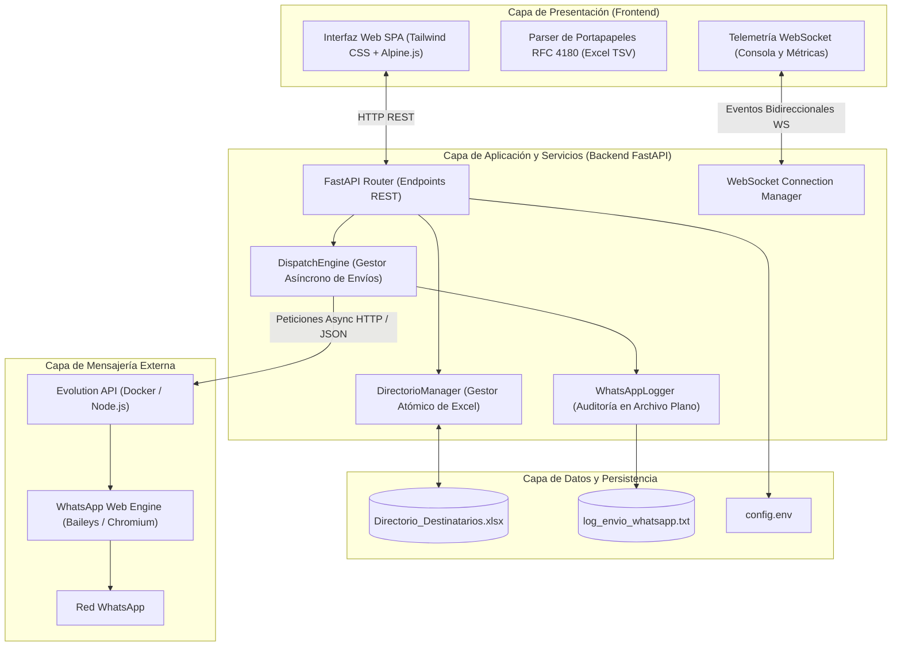
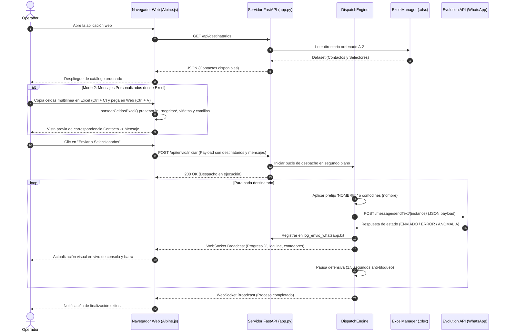
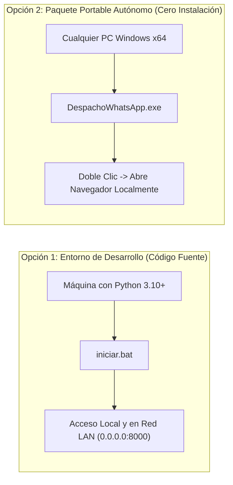
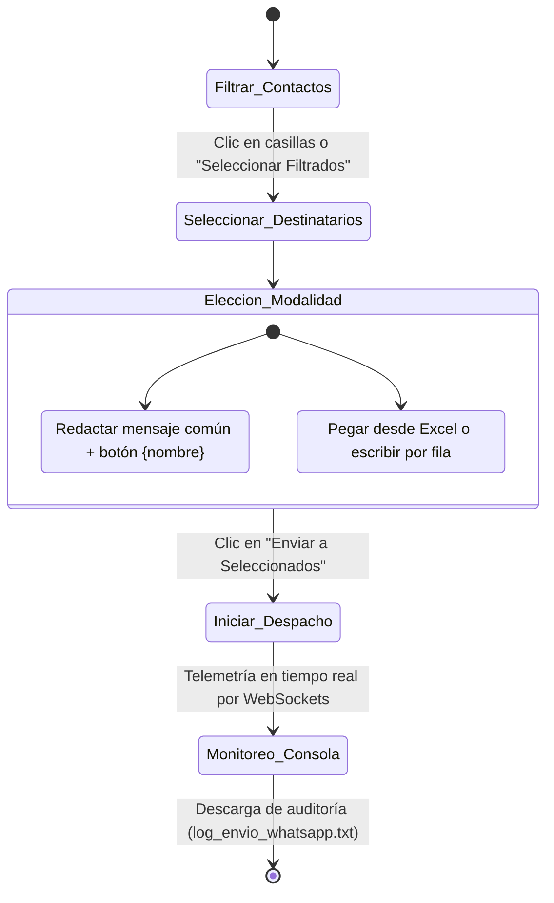

# 🚀 WhatsApp Enterprise Dispatch Engine (FastAPI + Evolution API)

[](https://www.python.org/)
[](https://fastapi.tiangolo.com/)
[](https://alpinejs.dev/)
[](https://tailwindcss.com/)
[](https://developer.mozilla.org/en-US/docs/Web/API/WebSockets_API)
[](https://github.com/EvolutionAPI/evolution-api)
[](https://www.microsoft.com/windows/)
[](#)

Sistema full-stack de grado industrial y ejecución local diseñado para la automatización, gestión y despacho masivo o personalizado de mensajería WhatsApp a través de **Evolution API**. Utiliza hojas de cálculo **Microsoft Excel (`.xlsx`)** como base de datos maestra persistente, incorpora telemetría en vivo vía **WebSockets**, mitigación defensiva contra bloqueos y empaquetado autónomo para despliegue **cero instalación** en cualquier estación de trabajo Windows.

---

## 📑 Tabla de Contenidos

- [1. Arquitectura de Software y Diagramas](#1-arquitectura-de-software-y-diagramas)
  - [1.1. Diagrama de Arquitectura de Capas](#11-diagrama-de-arquitectura-de-capas)
  - [1.2. Diagrama de Flujo de Datos y Secuencia](#12-diagrama-de-flujo-de-datos-y-secuencia)
- [2. Principios de Ingeniería y Características Core](#2-principios-de-ingeniería-y-características-core)
  - [2.1. Paradigma Dual de Despacho](#21-paradigma-dual-de-despacho)
  - [2.2. Parser RFC 4180 / TSV de Portapapeles de Excel](#22-parser-rfc-4180--tsv-de-portapapeles-de-excel)
  - [2.3. Búsqueda Abierta Multidimensional](#23-búsqueda-abierta-multidimensional)
  - [2.4. Telemetría en Tiempo Real y Pausa Defensiva](#24-telemetría-en-tiempo-real-y-pausa-defensiva)
- [3. Estructura del Catálogo Maestro (`Directorio_Destinatarios.xlsx`)](#3-estructura-del-catálogo-maestro-directorio_destinatariosxlsx)
- [4. Estructura del Proyecto](#4-estructura-del-proyecto)
- [5. Configuración de Entorno (`config.env`)](#5-configuración-de-entorno-configenv)
- [6. Opciones de Implementación y Puesta en Marcha](#6-opciones-de-implementación-y-puesta-en-marcha)
  - [Opción 1: Entorno de Desarrollo (Código Fuente Python)](#opción-1-entorno-de-desarrollo-código-fuente-python)
  - [Opción 2: Paquete Portable Autónomo (Cero Instalación - Windows)](#opción-2-paquete-portable-autónomo-cero-instalación---windows)
- [7. Manual Operativo de Uso](#7-manual-operativo-de-uso)

---

## 1. Arquitectura de Software y Diagramas

El sistema sigue una arquitectura desacoplada y orientada a eventos, organizada en 4 capas de responsabilidad:

### 1.1. Diagrama de Arquitectura de Capas



### 1.2. Diagrama de Flujo de Datos y Secuencia



---

## 2. Principios de Ingeniería y Características Core

### 2.1. Paradigma Dual de Despacho
El sistema provee dos modos de operación mutuamente excluyentes en la interfaz:
1. **Modo 1 ("Un mensaje a varios")**: Mensaje broadcast masivo con inyección de variables contextuales:
   - `{nombre}`: Sustitución en tiempo de ejecución por el nombre del contacto (Columna B de Excel).
2. **Modo 2 ("Mensajes personalizados por destinatario")**: Mensaje independiente por cada contacto:
   - Casilla de verificación individual o maestra (`NOMBRE: a todos`) para anteponer automáticamente `NOMBRE: <mensaje>`.
   - Soporte para copiar columnas completas desde Microsoft Excel / Google Sheets con preservación estricta de saltos de página.

### 2.2. Parser RFC 4180 / TSV de Portapapeles de Excel
Cuando una celda de Excel contiene saltos de línea internos (`Alt + Enter`, viñetas, párrafos), el portapapeles del sistema operativo encapsula la celda entre comillas dobles: `"Línea 1\r\nLínea 2"`.
- Se implementó un analizador de estados finitos (`parsearCeldasExcel`) en JavaScript que:
  - **No fragmenta** celdas multilínea: mantiene el mensaje íntegro para ese único contacto.
  - Elimina las comillas envolventes de transporte de Excel sin afectar comillas legítimas de redacción.
  - Asigna las celdas copiadas verticalmente hacia abajo en orden estricto A-Z.
  - Soporta pegado de múltiples columnas extrayendo la columna que contiene el mensaje.

### 2.3. Búsqueda Abierta Multidimensional
- Motor de búsqueda libre que opera sobre cualquier columna o renglón en tiempo real.
- **Normalización canónica**: Remueve acentos (`normalize('NFD')`), convierte a minúsculas e ignora signos diacríticos, garantizando coincidencia sin importar errores tipográficos.
- Coexistencia con 5 selectores independientes: *Tipo*, *Institución*, *Cliente*, *Profesión* y *Clave Tag*.

### 2.4. Telemetría en Tiempo Real y Pausa Defensiva
- Canal de **WebSockets nativo** para comunicación asíncrona dúplex.
- **Rate-Limiting Defensivo**: Intervalo parametrizable (por defecto `1.5s`) entre cada mensaje saliente para evitar detección por comportamiento anómalo o ráfagas masivas de WhatsApp.
- **Auditoría Estandarizada**: Salida concurrente a archivo plano `log_envio_whatsapp.txt` con marcas temporales ISO y clasificación de anomalías.

---

## 3. Estructura del Catálogo Maestro (`Directorio_Destinatarios.xlsx`)

El archivo Excel funge como el almacén maestro estructurado. Las columnas están tipificadas de la siguiente manera:

| Columna | Nombre de Campo | Tipo | Obligatorio | Descripción / Ejemplo |
|:---:|---|:---:|:---:|---|
| **A** | `numero_destinatario` | Entero / Cadena | Sí | Folio identificador único de control (`1`, `2`, `105`). |
| **B** | `nombre` | Cadena | Opcional | Nombre o alias descriptivo (usado para `{nombre}`). |
| **C** | `wa_destinatario` | Cadena | **Sí** | Nombre de ordenamiento principal en WhatsApp (`Ing. Juan Pérez`). |
| **D** | `numero_whatsapp` | Cadena | **Sí** | Número internacional con código de país o JID de grupo (`******` o `120363******@g.us`). |
| **E** | `tipo` | Cadena | Sí | Tipo de entidad: `Persona` o `Grupo`. |
| **F** | `institucion` | Cadena | Opcional | Empresa, dependencia o institución (`UCZ`, `Hospital`). |
| **G** | `cliente` | Cadena | Opcional | Clasificación comercial o etiqueta de cliente. |
| **H** | `profesion` | Cadena | Opcional | Cargo o profesión (`Médico`, `Director`, `Docente`). |
| **I** | `clave_busqueda` | Cadena | Opcional | Código de indexación o tag rápido (`VIP`, `ZONA-NORTE`). |

---

## 4. Estructura del Proyecto

```text
envios_Whatsapp/
├── app.py                             # Núcleo del Servidor FastAPI (REST + WebSockets)
├── config.env                         # Variables de entorno y configuración de conexión
├── Directorio_Destinatarios.xlsx      # Catálogo maestro de destinatarios
├── iniciar.bat                        # Script lanzador con enlace de red local (0.0.0.0)
├── requirements.txt                   # Manifiesto de dependencias Python
├── DespachoWhatsApp.spec              # Especificación de compilación con PyInstaller
├── src/
│   ├── services/
│   │   ├── dispatch_engine.py         # Motor de despacho, sustitución y rate-limiting
│   │   ├── evolution_client.py        # Cliente HTTP asíncrono hacia Evolution API
│   │   ├── excel_manager.py           # Gestor de I/O de Excel con bloqueo de hilos
│   │   └── logger_service.py          # Logger de eventos en log_envio_whatsapp.txt
├── templates/
│   └── index.html                     # Frontend SPA interactivo (Alpine.js + Tailwind)
└── dist/
    ├── DespachoWhatsApp.exe           # Binario ejecutable autónomo (38.7 MB)
    ├── Despacho_WhatsApp_Portable.zip # Paquete portable comprimido listo para transferir
    └── Despacho_WhatsApp_Portable/    # Carpeta distribuible con ejecutable y config.env
```

---

## 5. Configuración de Entorno (`config.env`)

El archivo `config.env` controla los parámetros de ejecución:

```ini
# Dirección de la Evolution API
EVOLUTION_URL=http://localhost:8080

# Instancia activa de WhatsApp vinculada en Evolution API
EVOLUTION_INSTANCE=******

# API Key configurada al desplegar Evolution API
EVOLUTION_APIKEY=******

# Ruta o nombre del archivo Excel de destinatarios
EXCEL_FILE=Directorio_Destinatarios.xlsx

# Archivo plano de bitácora y auditoría
LOG_FILE=log_envio_whatsapp.txt

# Pausa defensiva entre mensajes en segundos (recomendado: 1.5 a 3.0)
SEND_DELAY=1.5
```

---

## 6. Opciones de Implementación y Puesta en Marcha

El sistema está diseñado para implementarse bajo dos modalidades según las necesidades operativas:



---

### Opción 1: Entorno de Desarrollo (Código Fuente Python)
*Recomendada para la máquina principal de desarrollo o administradores del sistema.*

#### Requisitos Previos:
- Windows 10/11 con Python 3.10 o superior instalado.
- Instancia activa de **Evolution API** corriendo localmente en Docker (`http://localhost:8080`).

#### 1. Instalación y Configuración:
Clonar el repositorio y preparar el entorno virtual:
```powershell
# Clonar o ubicarse en el directorio del proyecto
cd D:\******\envios_Whatsapp

# Crear entorno virtual
python -m venv venv

# Activar entorno virtual
.\venv\Scripts\activate

# Instalar dependencias
pip install -r requirements.txt
```

#### 2. Inicio del Sistema:
Existen dos formas de iniciarlo:
- **Forma Automática:** Hacer doble clic en el archivo `iniciar.bat`.
- **Forma Manual por Consola:**
  ```powershell
  python app.py
  ```

#### 3. Modo de Uso y Acceso:
- **Acceso Local:** Abre automáticamente tu navegador en `http://localhost:8000`.
- **Acceso desde otra PC en la misma red Wi-Fi/LAN:**
  Cualquier otra computadora conectada a la misma red puede ingresar directamente desde su navegador (Edge, Chrome) a:
  ```text
  http://<IP_DE_TU_MAQUINA>:8000
  (Ejemplo: http://******:8000)
  ```
  *(No requiere instalar nada en las otras computadoras).*

---

### Opción 2: Paquete Portable Autónomo (Cero Instalación - Windows)
*Recomendada para operadores finales o para trasladar la solución a cualquier computadora de oficina sin instalar Python, Git, Docker ni dependencias.*

#### Requisitos Previos:
- Computadora con Windows 10, 11 o Windows Server (64 bits).
- Que la máquina de desarrollo (donde corre Evolution API) esté encendida en la misma red local o accesible vía IP.

#### 1. Implementación (Traslado a otra PC):
1. Copia el archivo comprimido `dist/Despacho_WhatsApp_Portable.zip` o la carpeta `dist/Despacho_WhatsApp_Portable/` a una memoria USB o compártela por red.
2. Pégala y descomprímela en la máquina de destino (por ejemplo, en el *Escritorio* o *Documentos*).
3. Abre el archivo `config.env` con el Bloc de Notas y confirma la IP de la máquina de desarrollo:
   ```ini
   EVOLUTION_URL=http://******:8080
   EVOLUTION_INSTANCE=******
   EVOLUTION_APIKEY=******
   EXCEL_FILE=Directorio_Destinatarios.xlsx
   LOG_FILE=log_envio_whatsapp.txt
   SEND_DELAY=1.5
   ```

#### 2. Inicio del Sistema:
1. Haz **doble clic en `DespachoWhatsApp.exe`**.
2. Se abrirá una ventana de terminal informando el inicio del servicio.
3. El sistema **abrirá automáticamente tu navegador web** predeterminado en `http://localhost:8000`.

#### 3. Modo de Uso:
- La aplicación leerá el archivo `Directorio_Destinatarios.xlsx` local de esa computadora.
- Todos los envíos se tramitarán a través de la Evolution API central sin que esa PC requiera Docker.
- Para cerrar el sistema, simplemente cierra la ventana de la terminal.

---

## 7. Manual Operativo de Uso



1. **Filtros y Búsqueda:** Utiliza los 5 selectores superiores o escribe en la barra de **Búsqueda Abierta** cualquier palabra o frase para filtrar el catálogo en vivo.
2. **Selección:** Marca individualmente los contactos deseados o presiona **`+ Seleccionar Filtrados`** para agregarlos a la tabla superior fijada en orden A-Z.
3. **Redacción / Pegado:**
   - **En Modo 1:** Escribe el texto en el área de redacción. Puedes usar el botón `+ Personalizar: {nombre}` para insertar el comodín.
   - **En Modo 2:** Haz clic en **`📋 Pegar desde Excel`**, pega la columna de mensajes copiada de tu hoja de cálculo y haz clic en **`✅ Aplicar Mensajes`**, o escribe/pega directamente en la celda de cada contacto.
4. **Despacho y Monitoreo:** Haz clic en **`Enviar a Seleccionados`**. Se desplegará la consola con la barra de progreso y el detalle de cada mensaje despachado.
5. **Auditoría:** Al concluir el despacho, presiona **`Descargar log`** para obtener el reporte plano de auditoría.

---

## 📄 Licencia y Mantenimiento

Desarrollado bajo arquitectura modular para máxima portabilidad y resiliencia en entornos corporativos de mensajería empresarial.